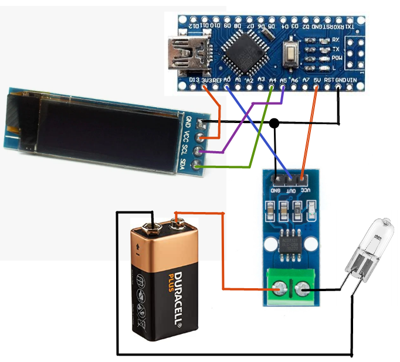
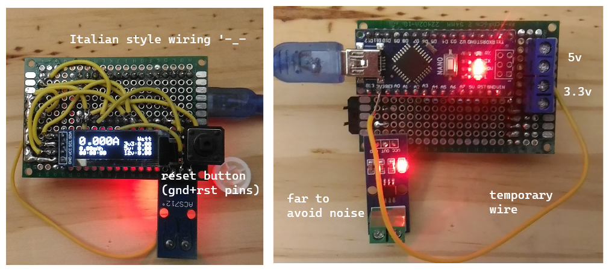

Ampmeter for ATX power supply (using ACS712 sensor and oled display)
=====================

Prototype on breadboard:
---------------------

  
  

Schema:
---------------------

Module:
---------------------

